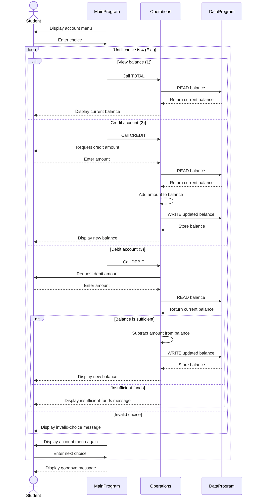

# COBOL Account Management System

This directory documents the COBOL account-management exercise in
`src/cobol`. The program models a simple student account with a stored
balance and supports balance inquiries, credits, and debits.

## Program Structure

### `data.cob` - `DataProgram`

`DataProgram` owns the account balance and provides the storage boundary used
by the rest of the application.

Key behavior:

- Initializes the balance to `1000.00`.
- Handles the `READ` operation by copying the stored balance to the caller.
- Handles the `WRITE` operation by replacing the stored balance with the
  caller's value.
- Uses six-character operation codes passed through the COBOL linkage section.

The balance is held in working storage, so it is available only while the
program is running. It is not persisted to a file or database.

### `operations.cob` - `Operations`

`Operations` contains the account business operations and communicates with
`DataProgram` to read and update the balance.

Supported operations:

- `TOTAL `: Reads and displays the current balance.
- `CREDIT`: Accepts an amount, adds it to the balance, stores the result, and
  displays the new balance.
- `DEBIT `: Accepts an amount, checks available funds, subtracts it when
  allowed, stores the result, and displays the new balance.

### `main.cob` - `MainProgram`

`MainProgram` is the interactive entry point. It repeatedly displays the
account-management menu, accepts a choice, and calls `Operations` with the
corresponding operation code.

Menu choices:

1. View balance
2. Credit account
3. Debit account
4. Exit

Invalid menu choices display an error and return to the menu.

## Student Account Business Rules

- Each run starts with a balance of `1000.00`.
- A credit increases the balance by the amount entered.
- A debit is permitted only when the current balance is greater than or equal
  to the requested amount.
- A debit that would exceed the available balance is rejected with an
  insufficient-funds message, and the stored balance is unchanged.
- The implementation models one in-memory account. It does not currently
  identify individual students, support multiple accounts, or retain data
  after the process exits.
- The source does not explicitly validate that entered amounts are positive or
  otherwise well-formed. Input is accepted according to the COBOL numeric
  field definition, so validation would be a future enhancement if required
  by the student-account domain.

## Operation Flow

`MainProgram` calls `Operations`, which reads the current balance from
`DataProgram` before changing it. Successful credits and debits write the
updated balance back through `DataProgram`; balance inquiries only read it.

## Application Data Flow

